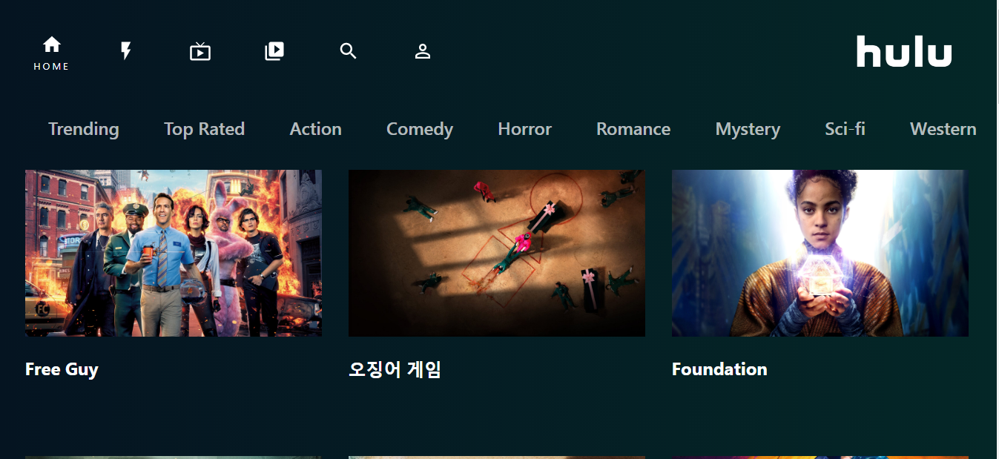

<p align="center">
   
</p>

# Chat App

[](https://github.com/imkousik9)

Hulu clone build using React, React-Hooks, Axios and the moviedb api.

# Application Links

Frontend Code -> [https://github.com/imkousik9/hulu-clone](https://github.com/imkousik9/hulu-clone)
<br>
Deployed URL -> [https://hulu-clone-kousik.netlify.app](https://hulu-clone-kousik.netlify.app)
<br>
API Doc -> [https://developers.themoviedb.org/3](https://developers.themoviedb.org/3)
<br>

**Run the site locally**

### Step 1: Clone The Repo

Fork the repository. then clone the repo locally by doing -

```bash
git clone https://github.com/imkousik9/hulu-clone.git
```

### Step 2: Install Dependencies

cd into the directory

```bash
cd hulu-clone
```

install all the dependencies

```bash
yarn
# or
npm install
```

### Step 3: Start Development Server

Then start the development Server

```bash
yarn dev
# or
npm run dev
```

After running the development server the site should be running on https://localhost:3000

# Tech Stack

<b>Frontend</b>: Reactjs, Axios
<br>
<b>API</b>: The MovieDB API
<br>
<b>Styling</b>: CSS
<br>
<b>Deployment</b>: Netlify
